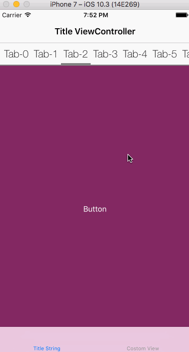

# HLTabPagerViewController

[](https://travis-ci.org/PandaApe/HLTabPagerViewController)
[](http://cocoapods.org/pods/HLTabPagerViewController)
[](http://cocoapods.org/pods/HLTabPagerViewController)
[](http://cocoapods.org/pods/HLTabPagerViewController)





## Installation
**CocoaPods** (recommended)
Add the following line to your `Podfile`:

`pod 'HLTabPagerViewController', '~> 0.1.0'`

And then add `import HLTabPagerViewController` to your view controller.

## Usage
To use it, you should create a view controller that extends `HLTabPagerViewController `. Write your `viewDidLoad` as follows:

```swift

override func viewDidLoad() {
super.viewDidLoad()

self.dataSource = self
self.delegate 	= self

self.reloadData()   
}

```

Then, implement the `HLTabPagerDataSource` to populate the view.
The data source has a couple of required methods, and a few more optional.

### Data Source
The data source methods will allow you to provide content to your tab pager view controller.

#### Required Methods
```swift
func numberOfViewControllers() -> Int

func viewController(forIndex index: Int) -> UIViewController

```

#### Optional Methods
**Note that despite being optional, the tab setup will require you to return either a `UIView` or an `String` to work.**

```swift

optional func viewForTab(atIndex index: Int) -> UIView
optional func titleForTab(atIndex index: Int) -> String
optional func tabHeight() -> CGFloat
optional func tabColor() -> UIColor
optional func tabBackgroundColor() -> UIColor
optional func titleFont() -> UIFont
optional func titleColor() -> UIColor
optional func bottomLineHeight() -> CGFloat

```

### Delegate
The delegate methods report events that happened in the tab pager view controller.

#### Optional Methods
```swift
optional func tabPager(_ tabPager: HLTabPagerViewController, willTransitionToTab atIndex: Int)
optional func tabPager(_ tabPager: HLTabPagerViewController, didTransitionToTab atIndex: Int)
```

### Public
There are two public methods:

```swift
open func reloadData()
open func selectTabbar(atIndex index: Int, animation: Bool = false) 
```

`reloadData` will refresh the content of the tab pager view controller. Make sure to provide the data source before reloading the content.

`selectTabbar` will return the index of the current selected tab.

And these public properties:

```swift
open weak var dataSource: HLTabPagerDataSource?
open weak var delegate: HLTabPagerDelegate?
open var selectedIndex = 0

```

